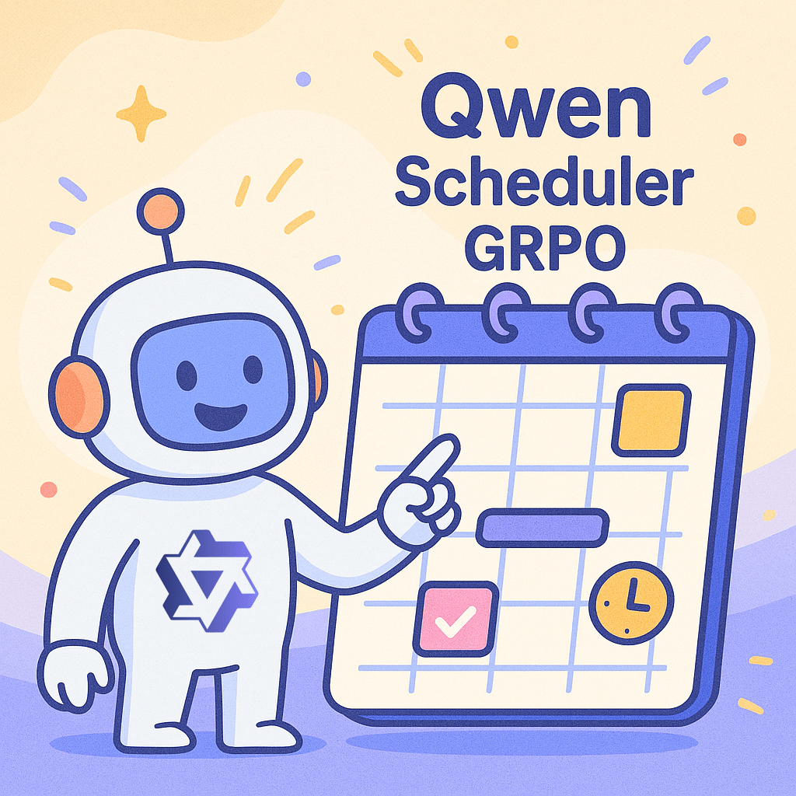
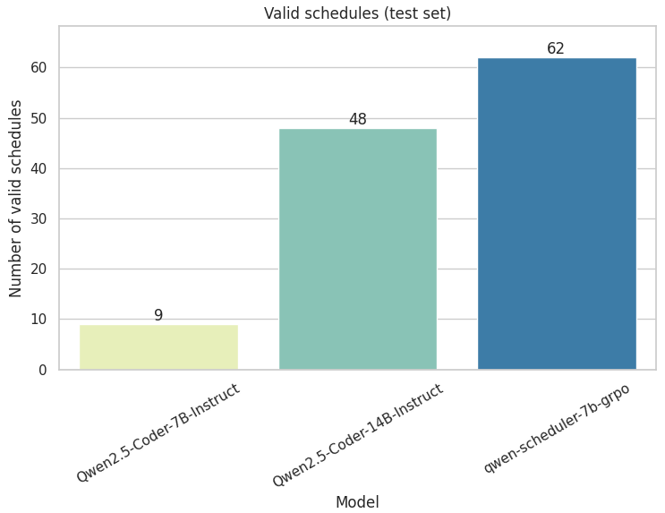

# Qwen Scheduler GRPO 👑 🗓️

I tried to teach a Language Model how to create a schedule from a list of events and priorities.

I used GRPO (Group Relative Policy Optimization), meaning the model is trained over time with Reinforcement Learning to reason and maximize
some reward functions. This differs from Supervised Fine-Tuning methods: we are not showing the model any target
completions, only the prompts.

I hope sharing this experiment is useful for anyone else diving into RL for LLMs.

➡️ Read the full story [in my blog post](PUTLKINK).

</img>

## The problem

Given a list of events and priorities, we ask the model to create a schedule that maximizes the total duration of selected events, weighted by priority.

In this setup, a priority event gets a weight of 2, and a normal event gets a weight of 1.

### Example input

Events:
- Event A (01:27 - 01:42)
- Event B (01:15 - 02:30)
- Event C (15:43 - 17:43)

Priorities:
- Event B

### Example output

```xml
<think>A detailed reasoning</think>
<schedule>
<event>
<name>Event B</name>
<start>01:15</start>
<end>02:30</end>
</event>
<event>
<name>Event C</name>
<start>15:43</start>
<end>17:43</end>
</event>
</schedule>
```

## Why?

Teaching a Language Model something that can be easily and efficiently solved with deterministic programming might 
sound not very useful... And that's fine!

But it's 2025, and everyone is trying GRPO with GSM8K or the Countdown Game...

I was fascinated by making an LLM learn without explicit examples, just prompts and rewards. And I wanted to try
something different.

Choosing an original problem (events scheduling) forced me to think about the problem setting, generate data, choose the base model, design reward functions (and experiment fun things like reward hacking!) and run multiple rounds of training, hoping that my model would learn something.

A fun and rewarding 😄 experience.

## Results

</img>

The training worked! The final 7B model improved on the task, significantly outperforming its base model and even a larger 14B model on the test set.

It got good at following the format and most rules.

However, it still struggles with preventing overlapping events, suggesting the reward function design for that specific constraint
could be improved.


## Repository organization
- [Dataset generation](./dataset_generation/): Script to generate the [Events Scheduling dataset](https://huggingface.co/datasets/anakin87/events-scheduling).
- [📓 GRPO Training Notebook](train_grpo.ipynb).
- [Prompts](prompts.txt): System and User prompt templates.
- [Evaluation](./evaluation/): Scripts for running inference and evaluating model outputs.  (Also contains saved outputs.)

## Materials
- [Blog post](PUTLKINK)
- [Events Scheduling dataset](https://huggingface.co/datasets/anakin87/events-scheduling)
- [Model: anakin87/qwen-scheduler-7b-grpo](https://huggingface.co/anakin87/qwen-scheduler-7b-grpo)
- [Weight and Biases report](https://api.wandb.ai/links/stefanofiorucci/22oryc3v)